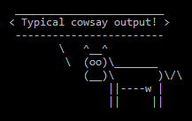
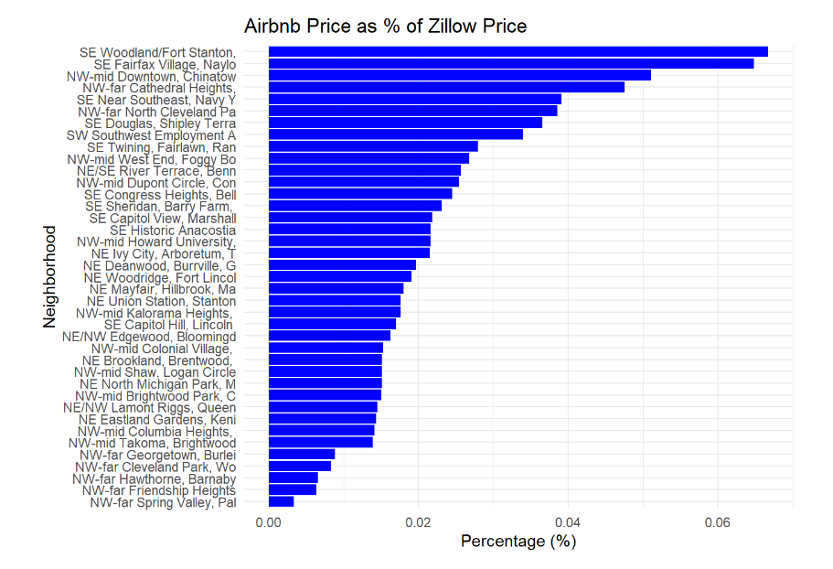
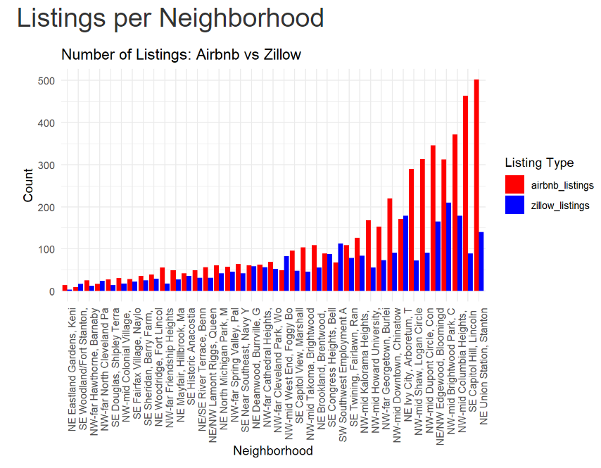
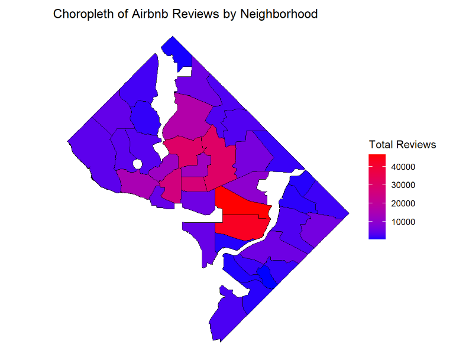
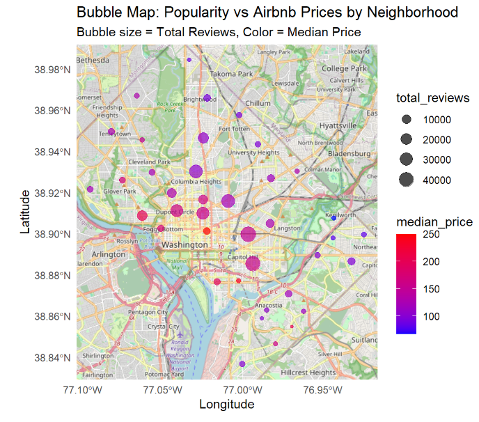
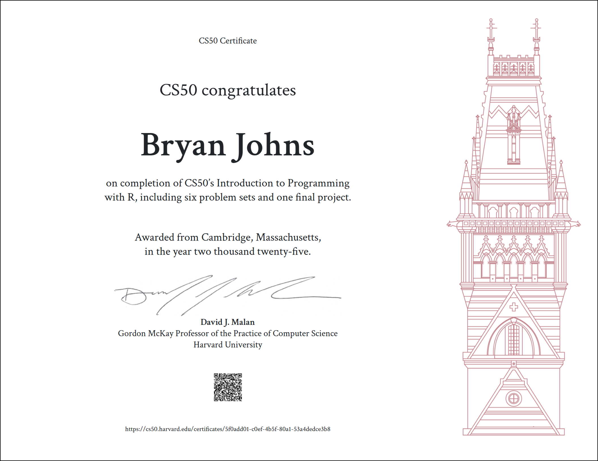

# DC-AirBnB-Zillow

R exploratory data analysis, comparing the Washington, DC Airbnb data with Zillow property data.

## Table of Contents

- [Description](#description)
- [Usage](#usage)
- [Gallery](#gallery)
- [Certificate](#certificate)
- [References](#references)
- [Licenses](#licenses)
- [Acknowledgements](#acknowledgements)
- [Author](#author)

## Description

An R Markdown exploratory data analysis (eda) comparing Zillow property prices with AirBnB rentals. The eda utilizes an R package for much of the data cleaning and preparation to fulfill the requirements for the final project of [cs50's Introduction to Programming with R](https://cs50.harvard.edu/r/2024/). This is my first ever eda in R, so it's more about practice than viable, useful insights.

## Usage

To use this project, follow these steps:

1. **Clone the Repository**:
Clone the repository to your local machine using the following command:

    ```sh
    git clone https://github.com/johbry17/DC-AirBnB-Zillow.git
   ```

2. **Open the R Project**: Open the R project file (DC-AirBnB-Zillow.Rproj) in RStudio.

3. **Install Required Packages**: Ensure you have all the required packages installed. You can install them using the following command in R:

    ```sh
    install.packages(c("tidyverse", "sf", "scales", "ggmap", "ggspatial", "rnaturalearth", "rnaturalearthdata", "devtools"))
    ```

4. **Load the Package**: Load the package that contains the data cleaning and preparation functions:

    ```sh
    devtools::load_all("./project")
    ```

5. **Open the R Markdown File**: Open the R Markdown file (eda_DC_Zillow_AirBnB.Rmd) in RStudio.

6. **Render the R Markdown File**: Render the R Markdown file to generate the HTML output. You can do this by clicking the "Knit" button in RStudio or by running the following command in R:

    ```sh
    rmarkdown::render("./project/inst/doc/eda_DC_Zillow_AirBnB.Rmd")
    ```

7. **View the HTML Output**: After rendering, the HTML output file will be generated in the same directory as the R Markdown file. You can open this file in your web browser to view the analysis. After rendering, open `./project/inst/doc/eda_DC_Zillow_AirBnB.html`.

The ducksay folder is an example project from cs50R that produces ASCII art, a la the famous cowsay:



## Gallery









## Certificate



## References

Datasets provided by [Inside AirBnB](http://insideairbnb.com/about/) and [Kaggle](https://www.kaggle.com/datasets/datadetective08/washington-d-c-housing-market-2024).

## Licenses

MIT License, copyright 2025, Bryan Johns

## Acknowledgements

Sincerest thanks to the entire cs50 team for creating an engaging and challenging learning experience.

## Author

Bryan Johns, February 2025
